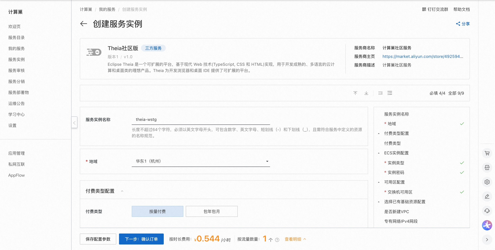
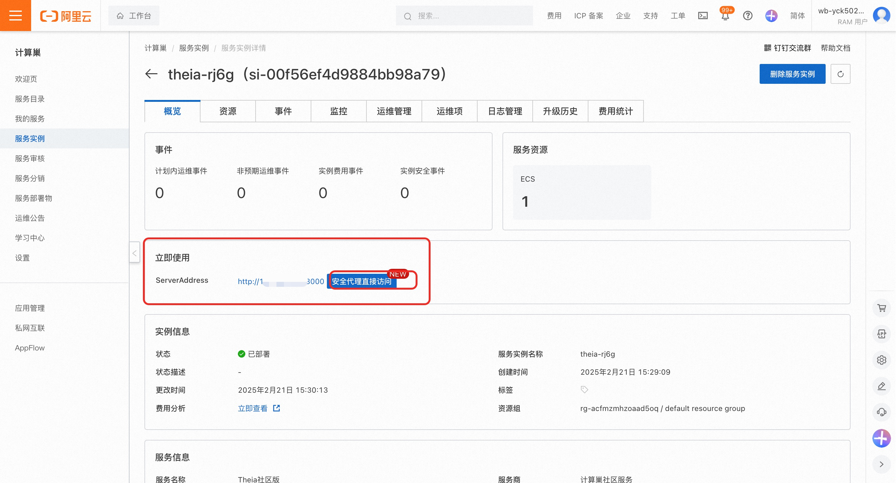
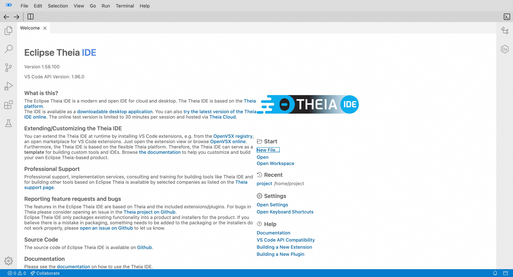

# Theia IDE 快速部署

## 概述

Eclipse Theia 是一个可扩展的平台，基于现代 Web 技术(TypeScript, CSS 和 HTML)实现，用于开发成熟的、多语言的云计算和桌面类的理想产品。Theia
为开发浏览器和桌面 IDE 提供了可扩展的平台。

## 前提条件

部署Theia社区版服务实例，需要对部分阿里云资源进行访问和创建操作。因此您的账号需要包含如下资源的权限。
**说明**：当您的账号是RAM账号时，才需要添加此权限。

| 权限策略名称                          | 备注                         |
|---------------------------------|----------------------------|
| AliyunECSFullAccess             | 管理云服务器服务（ECS）的权限           |
| AliyunVPCFullAccess             | 管理专有网络（VPC）的权限             |
| AliyunROSFullAccess             | 管理资源编排服务（ROS）的权限           |
| AliyunComputeNestUserFullAccess | 管理计算巢服务（ComputeNest）的用户侧权限 |

## 计费说明

Theia 社区版在计算巢部署的费用主要涉及：

- 所选vCPU与内存规格
- 系统盘类型及容量
- 公网带宽

## 部署流程

1. 访问计算巢Theia社区版[部署链接](https://computenest.console.aliyun.com/service/instance/create/cn-hangzhou?type=user&ServiceName=Theia%E7%A4%BE%E5%8C%BA%E7%89%88)，按提示填写部署参数：
   

2. 参数填写完成后可以看到对应询价明细，确认参数后点击**下一步：确认订单**。

3. 确认订单完成后同意服务协议并点击**立即创建**进入部署阶段。

4. 等待部署完成后就可以开始使用服务，进入服务实例详情点击**安全代理直接访问**。
   

5. 加载完成后即可使用Theia-IDE。
   

## 使用帮助
更多用法请参考[Theia官方文档](https://theia-ide.org/docs/)。